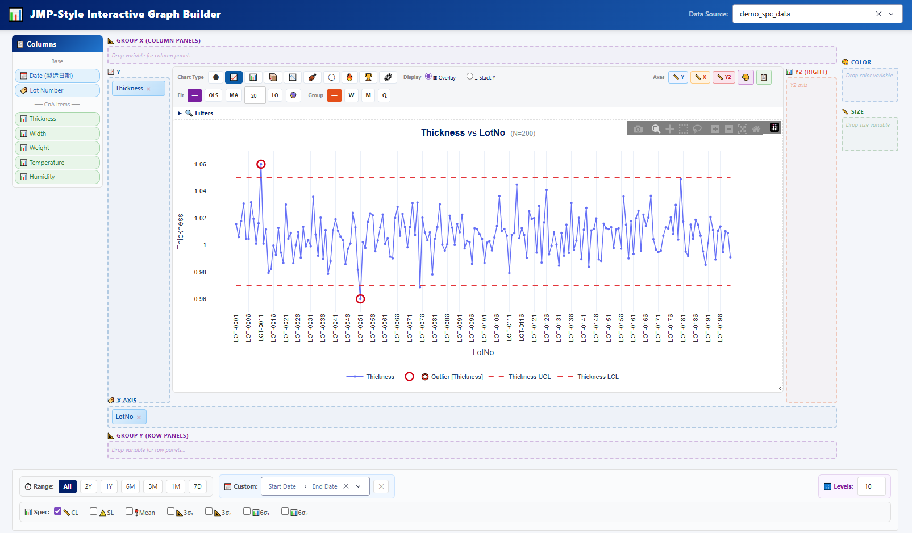

# JMP-Style Interactive Graph Builder

A standalone, JMP-style interactive graph builder for data visualization and SPC analysis.



## Features

- **Dynamic Axis Mapping** — Drag-and-drop columns to X / Y / Color / Size / Group zones
- **Multiple Chart Types** — Scatter, Line, Bar, Box, Histogram, Violin, Bubble, Heatmap, Pareto, Correlation
- **Trend Lines** — Rolling MA, OLS (Linear Regression), LOWESS, Forecast
- **Faceting** — Group X / Group Y for subplot panels
- **Dual Y-axis** — Independent Y2 axis support
- **Spec Lines** — CL, SL, Mean, ±3σ / ±6σ reference lines
- **Stack Y** — Split multiple Y variables into separate panels
- **Dynamic Filters** — Pattern-matching filter rows for data subsetting
- **Data Preview** — Interactive data table for filtered data inspection
- **Export** — Excel (with embedded chart), PNG, Clipboard copy

## Quick Start

```bash
# Install dependencies
pip install -r requirements.txt

# Generate sample data (optional)
python generate_sample_data.py

# Run the app
python main.py
```

Then open **http://localhost:8050** in your browser.

## Data Files

Place your CSV / Excel (.xlsx, .xls, .xlsm) / Parquet files in the `sample_data/` folder.
They will appear in the dropdown automatically.

### Expected Columns

The graph builder works with any tabular data. For SPC-specific features:

| Column | Purpose |
|---|---|
| `LotNo` or `Lot` | Row identifier (auto-generated if missing) |
| `製造日期` or any date column | Date axis for time-series |
| Any numeric column | Available as Y-axis measurement |

## Project Structure

```
JMP-GraphBuilder/
├── app/
│   ├── core/
│   │   ├── constants.py        # Colors & style tokens
│   │   └── textutils.py        # Export filename utilities
│   ├── models/
│   │   └── data_loader.py      # CSV/Excel/Parquet file loader
│   └── views/
│       ├── chart_utils.py      # Float-precision & statistics helpers
│       ├── graph_builder_layout.py   # Static layout (component tree)
│       ├── graph_builder_render.py   # Trendline & spec-line render helpers
│       ├── graph_builder_style.py    # Style constants
│       └── page_graph_builder.py     # Callback registration (main logic)
├── assets/
│   ├── graph_builder.css       # Graph Builder CSS
│   ├── graph_builder_dnd.js    # Drag & Drop interaction JS
│   └── gb_resize.js            # Chart resize handler JS
├── docs/
│   └── screenshot.png          # App screenshot
├── sample_data/                # Place your data files here
├── main.py                     # Entry point
├── requirements.txt
└── README.md
```
